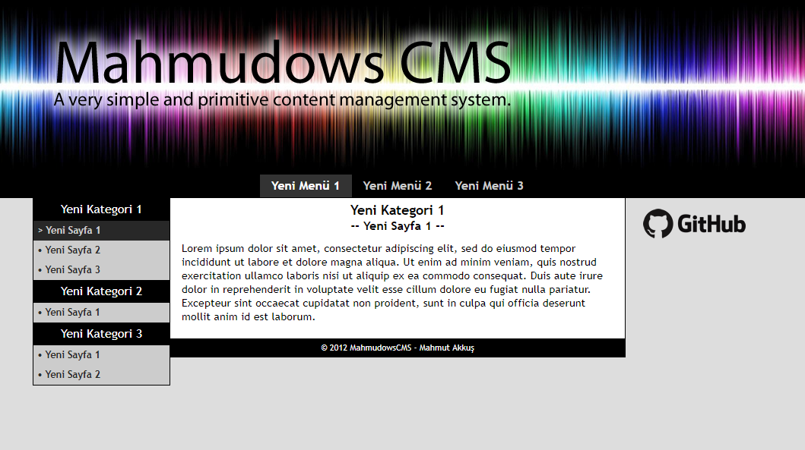
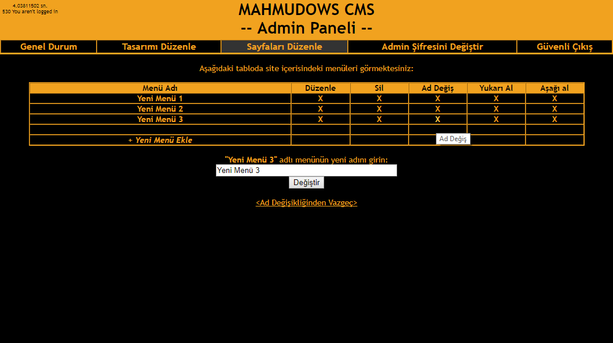

# MahmudowsCMS
A very simple and primitive content management system I made very very earlier, probably in 2012 if I remember correctly. But it still does the work. It doesn't use a database and directly store all the data in plain text files and directories. I still use it in my website.

## How to set it up?
1) Put all the files in your server.
2) Using a text editor, edit "admin.php", follow the instructions there. You need to write down FTP host, username, password and root directory.
3) Again, using a text editor, change the password in "MCMSR/secured/pass.txt". *Yep, it's stored as a plaintext :), but it's permissions are gonna be set to prevent anyone looking at it, except the server admin.*
4) Now you can go to "yoursite.com/admin.php" in the browser and login with the password.
5) In the admin panel, you can add 1st level categories, 2nd level sub-categories to them, and pages to the sub categories. You can delete or modify existing ones. Oh, you can also change the password from there.
6) Changes will appear immediately in "yoursite.com".
7) To change the appearance of your site, you have to manually edit "index.php", images, .css files, etc.

### Here is a screenshot:

### Here is a screenshot of admin panel:
